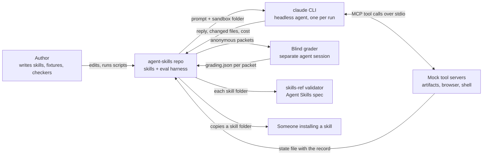
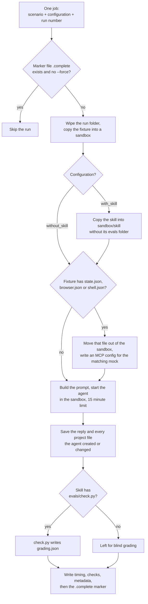

# agent-skills: Architecture

Last checked against the code: 2026-10-09, commit `8acac1c`.

How the repo fits together: what a skill is made of, and how the eval harness measures one. For what each skill does for its user, read the [README](README.md).

## What it is

Five agent skills in the open [Agent Skills](https://agentskills.io) format, and a small harness that measures each one.

A skill is a folder with a `SKILL.md` that an agent reads and follows. The harness runs the same scenario twice, once with the skill and once without, in a throwaway sandbox, and grades both runs against the same list of expectations.

The design in one sentence: **the skills are plain text, and everything risky they could do during a test (clicking, typing, running commands, writing a database) goes to a mock that records it and does nothing.**

## System context

Nothing here is a running service. Every arrow is a script the author starts by hand.

## What is in the repo

| Path | What it is |
|---|---|
| `skills/<name>/SKILL.md` | The skill: front matter (name, description, license, metadata) and the instructions |
| `skills/<name>/scripts/`, `references/`, `assets/` | Files the skill tells the agent to use. Only `guided-tour` and `todo-list` have them |
| `skills/<name>/evals/evals.json` | The scenarios: prompt, fixture folder, expectations |
| `skills/<name>/evals/files/<scenario>/` | One fixture per scenario |
| `skills/<name>/evals/check.py` | Code grader. Present for `todo-list`, `guided-tour`, `claude-tui-study-buddy` |
| `skills/<name>/evals/build_fixtures.py` | Generates the fixtures and `evals.json`. Present for `guided-tour` and `claude-tui-study-buddy` |
| `skills/<name>/evals/results/` | Committed receipts: every run's grade and evidence |
| `skills/<name>-workspace/` | Raw run output. Gitignored |
| `scripts/run_evals.py` | The eval runner |
| `scripts/mock_artifacts.py`, `mock_browser.py`, `mock_shell.py` | The three mock tool servers |
| `scripts/blind_grading.py` | Packs runs for a grader that cannot see which configuration made them |
| `scripts/benchmark.py` | Collects code-graded runs into a receipts file |
| `scripts/validate.sh` | Runs the spec's reference validator over every skill |
| `tests/` | pytest suite for the mocks, the checkers, the runner's resume logic, `writes.py`, `reminders.py` and the `todo-list` page |
| `.githooks/pre-commit` | Blocks a commit whose added lines match a known secret pattern |

## Tech stack

| Layer | What | Note |
|---|---|---|
| Skills | Markdown with YAML front matter | Agent Skills format |
| Harness | Python 3, standard library only | No `pyproject.toml`, no dependencies to install |
| Agent under test | `claude -p --restricted` | Built in `agent_cmd()` in `run_evals.py`; swap that function to test another agent |
| Mock tools | MCP over stdio, hand-written JSON-RPC loop | Each mock is one file with no MCP library |
| Tests | pytest, run through `uv run --with pytest` | 120 tests as of 2026-10-09 |
| Validation | `skills-ref`, run through `uvx` | The spec's reference validator |
| `guided-tour` helper | One JavaScript file, `spotlight.js` | Pasted into the browser's JavaScript tool |
| `todo-list` page | One HTML file, `assets/todo-list.html` | Loads SortableJS from a CDN; data comes from the Artifact database; calendar reminders go through the viewer's Google Calendar connector (the `mcp` capability), when the page was published with it |

## The skills

| Skill | Files beyond `SKILL.md` | Tools it needs from the agent | Eval scenarios | Graded by |
|---|---|---|---|---|
| `sum` | none | none | 3 | blind grader |
| `critique` | none | none | 3 | blind grader |
| `todo-list` | `scripts/writes.py`, `scripts/reminders.py`, `references/schema.md`, `assets/todo-list.html` | Artifact and ArtifactData | 6 | `check.py` |
| `guided-tour` | `scripts/spotlight.js`, `references/practice-environments.md` | Browser tools that read the page and run JavaScript | 19 | `check.py` |
| `claude-tui-study-buddy` | none | A terminal session where the user runs commands | 13 | `check.py` |

Two of the skills carry code that does real work:

**`spotlight.js` (guided-tour).** The agent replaces two placeholders (the target text and a tag label) and runs it in the page.

1. It collects every document it can reach: the page, same-origin iframes, open shadow roots.
2. It clears any earlier highlight and puts back each element's original outline.
3. It finds visible elements whose label, title, placeholder, value or text contains the target.
4. It picks one: interactive controls first, then exact matches, then the shortest label.
5. It outlines that element, scrolls it into view and adds a floating tag.
6. It returns `ok: <tag> '<text>'`, `cleared` or `not found`.

It only changes outline styles and adds the tag. It never clicks or types.

**`writes.py` (todo-list).** The agent runs it to build the `writes` array for one change, then passes the output to one ArtifactData `batch` call.

- Every change comes out with its matching `history` entry.
- Due dates (added 2026-10-10): `add --due`, `due` and `synced` write an item's `due`, and the calendar event that reminds of it (`calEvent`, with `calDue` holding the date that event was made for). `scripts/reminders.py plan` reads items and prints the calendar calls needed to make events match them; it calls nothing itself.
- Every delete carries a snapshot of the deleted documents, so the page's Restore button can recreate them under their original ids.
- Every write to an existing document carries `if_version`, the version the agent read.
- Bad or incomplete input exits before anything is printed.
- More than 50 writes is refused, not truncated.

Its nine actions: `add`, `check`, `uncheck`, `edit`, `move`, `delete`, `new-list`, `rename`, `delete-list`.

## How one eval run works

`scripts/run_evals.py <skill> --iteration N --runs K` builds one job per scenario, per configuration (`with_skill`, `without_skill`), per run number. Jobs run in a thread pool, 4 at a time by default.

The same thing as steps:

1. **Skip if finished.** A run folder that holds `.complete` is skipped. `--force` redoes it. A folder without the marker is deleted and started again.
2. **Build the sandbox.** The scenario's fixture folder is copied to `run-K/sandbox`.
3. **Add the skill, or not.** For `with_skill`, the skill folder is copied to `sandbox/skill` with `evals/` left out. For `without_skill`, nothing is added.
4. **Wire a mock if the fixture asks for one.** The state file is moved up to `run-K/state.json`, outside the sandbox, so the agent reaches it only through the mock's tools. An MCP config points at the mock script and passes the state path in `MOCK_STATE`.
5. **Build the prompt.** If the fixture has `transcript.md`, the prompt says "this is your session so far, here is the user's next message". If it does not, the prompt says a user is starting a conversation. The `with_skill` prompt adds one line: a skill is installed at `./skill/SKILL.md`, read it first and follow it. A scenario's optional `harness_note` is added to both.
6. **Run the agent.** `claude -p` with `--restricted`, `--strict-mcp-config`, `--permission-mode acceptEdits`, `--no-session-persistence` and JSON output, working directory set to the sandbox. With a mock, the tool list is cut down to file tools plus that mock's tools (the artifacts mock also allows `python3` in the shell, which `writes.py` needs).
7. **Collect.** The reply goes to `outputs/reply.md`. The project folder is compared with the fixture's, and every created or changed file is copied to `outputs/`.
8. **Grade by code, if the skill has a checker.** `check.py` gets the scenario name, the fixture, the run folder and the skill folder, and prints `grading.json`.
9. **Write the record, marker last.** `timing.json`, `checks.json`, `eval_metadata.json`, then `.complete`.

`--regrade` re-runs `check.py` over runs already on disk without calling the agent. `--only NAME` runs one scenario.

### What can go wrong in a run

| Case | What happens |
|---|---|
| The agent's output is not JSON | The reply is saved as empty and the tail of the output is kept as `agent_error` in `checks.json` |
| The agent runs past 15 minutes | The runner raises. That run has no marker, so repeating the command redoes it |
| `check.py` exits non-zero | The runner raises with the checker's error. No marker is written |
| The batch is interrupted | Finished runs keep their marker; repeating the command picks up the rest |
| A mock gets a bad tool call | It answers with an error result and, for the artifacts mock, writes nothing |

## The three mocks

Each mock is an MCP server in one file. It keeps all its state in one JSON file, so a scenario seeds that file before the run and the grader reads it afterwards.

| Mock | Chosen by | Tools it offers | What it records | What it really does |
|---|---|---|---|---|
| `mock_artifacts.py` | `state.json` | `Artifact`, `ArtifactData` | Every call with its arguments, plus the resulting artifacts and database | Keeps a small versioned document store in the file |
| `mock_browser.py` | `browser.json` | 9 browser tools (tabs, navigate, read, find, JavaScript, mouse and keyboard, form input) | Every navigation, read, click, keystroke, key press, script and spotlight | Serves a fake web app from the file; an "action" only records that it was triggered |
| `mock_shell.py` | `shell.json` | `run` | Every command and the exit code it was given | Answers from scripted regex matches; executes nothing |

Details that matter when reading the results:

- **Artifacts mock.** A write to an existing document needs a matching `if_version` or it is refused. A batch takes 1 to 50 writes, addresses each document once, and applies all of them or none (it runs on a copy first). Queries support `==` and `!=` only.
- **Browser mock.** Elements have a kind: `nav` and `view` are read-only, `action` changes state, `field` accepts typing. An overlay hides the page until one of its controls dismisses it. A script is never run; the mock recognises the skill's spotlight script by its shape, and for any other script it records whether the code clicks, sets a value or restyles something. Navigation outside the app's origin is refused and recorded. Screenshots and clicks by coordinate are refused.
- **Shell mock.** A command that matches no scripted response gets empty output and exit 0.

## Grading

There are two paths. The run folder ends up with the same `grading.json` shape either way: a list of `{text, passed, evidence}` and a summary.

### Code grading (`check.py`)

| Skill | What the checker reads | How scenarios map to checks |
|---|---|---|
| `todo-list` | Database before and after, the list of tool calls, the reply | One function per scenario (6) |
| `guided-tour` | The browser's event record, the reply | 7 check kinds shared by 19 scenarios; each scenario's `check` block in `evals.json` picks the kind and its parameters |
| `claude-tui-study-buddy` | The shell's command record, the study guide before and after, the reply | 11 check kinds shared by 13 scenarios, picked the same way |

The expectation text in `evals.json` is the checker's own wording. Tests fail if the two drift.

### Blind grading (`sum`, `critique`)

1. `blind_grading.py pack` copies every run of an iteration into packets named `r01`, `r02`, and so on, in shuffled order.
2. Each packet holds the run's outputs, `checks.json`, the transcript, the untouched project fixture and a `task.json` with the user's message and the expectations. Nothing in it names the configuration.
3. The packet-to-run mapping is written to a separate map file.
4. A grader writes `grading.json` into each packet.
5. `blind_grading.py unpack` checks each grading file (same expectations in the same order, a true or false for each, evidence for each), adds the summary and copies it back to the run folder. A missing or malformed packet is reported and the command exits non-zero.

The shuffle is seeded with the skill name and iteration number, so the same pack command gives the same order.

### Receipts

`scripts/benchmark.py` reads every graded run of an iteration and writes `skills/<name>/evals/results/<date>-benchmark.json`: each run's grade, evidence, time, tokens and cost, plus totals per configuration. It refuses to write if any scenario has a different number of runs from the others.

Only the `claude-tui-study-buddy` receipts have the exact shape `benchmark.py` writes. The other four files carry a `delta` block and no pass totals in their summary; the per-run grades and evidence are in the same form.

Results as of the committed receipts (expectations passed, all scenarios x 3 runs, Claude Opus 5.5):

| Skill | With the skill | No skill | Measured | Receipts |
|---|---|---|---|---|
| `sum` | 90 / 90 | 72 / 90 | 2026-10-05 | `skills/sum/evals/results/` |
| `critique` | 72 / 72 | 55 / 72 | 2026-10-05 | `skills/critique/evals/results/` |
| `todo-list` | 93 / 93 | 68 / 93 | 2026-10-05 | `skills/todo-list/evals/results/` |
| `guided-tour` | 291 / 291 | 202 / 291 | 2026-10-05 | `skills/guided-tour/evals/results/` |
| `claude-tui-study-buddy` | 207 / 207 | 194 / 207 | 2026-10-07 | `skills/claude-tui-study-buddy/evals/results/` |

The README's Evals section says where each gap is and how far these numbers can be trusted.

## Command-line surface

| Command | What it does |
|---|---|
| `scripts/run_evals.py <skill> --iteration N [--runs K] [--model M] [--jobs J] [--only NAME] [--force] [--regrade]` | Runs or regrades an iteration |
| `scripts/blind_grading.py pack <skill> --iteration N` | Builds anonymous grading packets |
| `scripts/blind_grading.py unpack <skill> --iteration N` | Validates the gradings and copies them back |
| `scripts/benchmark.py <skill> --iteration N --tools TEXT [--model M] [--note TEXT]` | Writes the receipts file for a code-graded skill |
| `scripts/validate.sh` | Validates every skill against the spec |
| `skills/<name>/evals/build_fixtures.py` | Regenerates that skill's fixtures and `evals.json` |
| `skills/<name>/evals/check.py <scenario> <fixture-dir> <run-dir> <skill-dir>` | Grades one run and prints `grading.json` |
| `skills/todo-list/scripts/writes.py <action> ...` | Prints the batch of writes for one list change |

## Data model

Everything is files. There is no database in the repo; the only database is the one the `todo-list` page uses when it is published.

### A scenario in `evals.json`

| Field | Holds |
|---|---|
| `id`, `name` | Number and slug. The name is also the fixture folder and the run folder |
| `prompt` | The user's message the agent answers |
| `files` | The fixture folder, as a one-item list |
| `expected_output` | A plain-language description of a good answer |
| `expectations` | The list each run is graded against |
| `check` | Code-graded skills only: the check kind and its parameters |
| `harness_note` | Optional line added to the prompt for both configurations |

### A fixture folder

| File | Optional | Meaning |
|---|---|---|
| `transcript.md` | yes | The session so far. Without it the agent starts fresh |
| `project/` | yes | The folder that session was working in |
| `state.json` | yes | Seeded database for the artifacts mock |
| `browser.json` | yes | Fake web app for the browser mock |
| `shell.json` | yes | Scripted answers for the shell mock |

### A run folder

`skills/<skill>-workspace/iteration-N/eval-<name>/<config>/run-K/`

| File | Holds |
|---|---|
| `sandbox/` | The folder the agent worked in |
| `state.json`, `mcp.json` | The mock's state after the run and its config (mock scenarios only) |
| `outputs/reply.md` | The agent's final message |
| `outputs/<file>` | Each created or changed project file, path flattened with `__` |
| `outputs/state_after.json` | Copy of the mock state (mock scenarios only) |
| `checks.json` | Files created, changed and deleted; reply length; any agent error |
| `timing.json` | Duration, tokens, cost, turn count |
| `grading.json` | Per-expectation pass or fail with evidence, and the summary |
| `eval_metadata.json` | Scenario id, name, prompt and expectations |
| `.complete` | Empty marker, written last |

### The `todo-list` page's database

Three collections, defined in `skills/todo-list/references/schema.md`:

| Collection | Key | Holds |
|---|---|---|
| `lists` | slug | `name`, `order` |
| `items` | random id, or `c<epoch ms><nn>` when written from chat | `list`, `text`, `done`, `created`, `doneAt`, `order`, optional `due`, `calEvent`, `calDue` |
| `history` | `h<epoch ms><nn>` when written from chat | `at`, `type`, `text`, `list`, `listName`, `by`, `restored`, optional `snapshot` |

The page subscribes to all three and redraws when any of them changes. It is published with two capabilities: `db` for the data and `user` so it can hide edit controls from a read-only viewer.

## Tests and validation

`uv run --with pytest --with playwright pytest tests` runs 236 tests (2026-10-10); 68 of them drive the `todo-list` page in a headless browser and are skipped without Playwright. No test calls an agent.

| File | What it pins down |
|---|---|
| `test_todo_writes.py` | Every `writes.py` action: history entry, snapshot, version pin, the 50-write limit, clean failure on incomplete input; due dates and event links, including that a delete snapshot never keeps a link to a deleted event |
| `test_todo_reminders.py` | The reminder plan: one event per open item with a date still ahead, at the stated times with both reminders; updates for a moved date; deletes for anything checked off, undated or gone |
| `test_todo_page.py` | The page in headless Chromium against an in-memory database with the clock pinned: badge wording and urgency, the writes the page makes, that a due date never moves an item, badge colours in both themes; the page's own calendar reminders against a stand-in connector (every create, move and delete, each failure code, undo races, and that the page and `reminders.py` plan the same event). Skipped when Playwright is not installed |
| `test_evals_consistent.py` | `todo-list` expectations match the checker's wording; a run that does nothing fails every scenario |
| `test_guided_tour_evals.py` | The browser mock and checker: a click, a script click, a typed secret, a followed injection and a second stop each fail; a do-nothing run never gets full marks; fixture folders hold only the app and the transcript, and none of the secrets the checker looks for; stored results cover every scenario |
| `test_study_buddy_evals.py` | The shell mock and checker: state-changing commands are caught, read-only ones are not; running the task, ticking a failed task, a wrong rating and an invented time each fail; stored results match the current checks |
| `test_run_evals_resume.py` | A finished run is skipped without calling the agent; a half-finished one is redone from scratch; `--force` redoes a finished one |

`scripts/validate.sh` runs `skills-ref` over each folder under `skills/` that has a `SKILL.md`.

## Install and release

There is no build and no deploy.

1. A skill is installed by copying its folder to wherever the agent loads skills from. `evals/` can be left out.
2. The pre-commit hook is turned on once per clone with `git config core.hooksPath .githooks`.
3. There is no CI workflow in the repo. Validation and tests are run by hand.
4. Fixtures for `guided-tour` and `claude-tui-study-buddy` are generated: edit `build_fixtures.py`, run it, commit the output.

## Key decisions and their cost

| Decision | What it gives | What it costs |
|---|---|---|
| Every scenario runs with and without the skill | The score is a difference against a baseline, not a pass mark | Twice the agent calls |
| Runs use `claude -p --restricted` | Neither configuration sees the author's own settings or instruction files | Tied to one CLI; another agent means rewriting `agent_cmd()` |
| Tools that could change something are mocks | A test can let the agent click Delete or run `rm` and nothing is at risk | The mock is not the real service; the real browser extension, Artifact service and shell are never exercised |
| Mocks are single files with a hand-written MCP loop | No dependencies; the state file is the whole record | Only the handful of MCP methods the CLI needs are implemented |
| The mock's state file sits outside the sandbox | The agent can only reach it through the tools | The checker needs the run folder layout to find it |
| Code grading where the outcome is checkable | Same grade every time, no grader cost, regrade without re-running | Reply checks are regular expressions, which can miss a valid wording |
| Blind grading where the outcome is prose | The grader cannot favour the skill | Needs a second agent session and a manual pack and unpack step |
| Expectation text lives in the checker and is copied to `evals.json` | What people read and what grades cannot drift | Changing a check means regenerating and recommitting fixtures |
| A `.complete` marker written last | An interrupted batch resumes without paying for finished runs | A run that died mid-way is thrown away whole |
| Raw runs are gitignored; only receipts are committed | The repo stays small | The raw outputs behind the receipts exist only on the machine that ran them |
| The skill is given by path in the prompt ("read it first and follow it") | The two configurations differ by one folder and one line of prompt | Does not test whether the skill's description would trigger on its own |
| `todo-list` writes go through a helper script | History, snapshots and version pins are right every time | The agent needs a shell with `python3` |

## Known limits

- Every scenario is one turn. The harness sees that a turn ended, not what the agent does on the next one.
- Triggering is not tested: the agent is told the skill applies.
- One model, three runs per scenario, 3 to 19 scenarios per skill.
- Most `guided-tour` and `claude-tui-study-buddy` scenarios continue a transcript, so the no-skill agent has earlier turns to imitate.
- `spotlight.js` is never executed in the evals. The browser mock recognises it and answers as it would.
- The artifacts mock supports two query operators and does not model access rules.
- The shell mock answers exit 0 to anything unscripted, so a command the fixture did not expect looks like it worked.
- Blind grading needs `transcript.md` and `project/` in the fixture; `pack` fails on a fixture without them.
- No CI. Nothing stops a commit that breaks the tests or the validator.
- No `pyproject.toml`; the Python version is whatever `python3` is.

## If it had to grow (not built)

None of this exists.

- **CI.** A workflow that runs `validate.sh` and the tests on every push.
- **Multi-turn scenarios.** A scripted user that sends a second and third message, so waiting, `back` / `skip` controls and resuming can be graded.
- **Trigger evals.** Scenarios where the skill is installed but not named, to measure whether the description alone gets it loaded.
- **A second agent.** `agent_cmd()` turned into a small adapter table so the same scenarios run against another CLI.
- **A real browser for `spotlight.js`.** A headless-browser test over pages with iframes and shadow DOM.
- **More models and more runs**, with the spread reported next to the totals.
